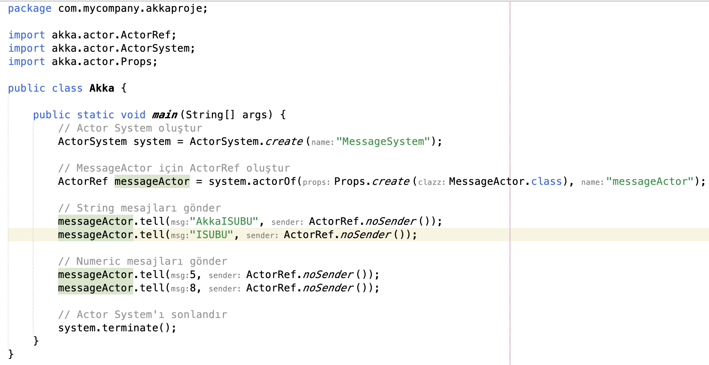
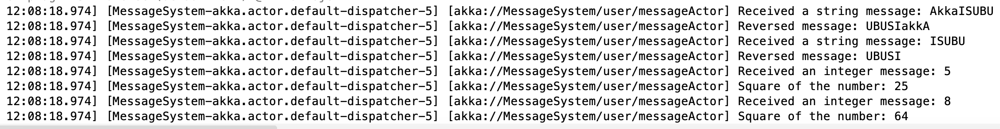

# Akka Actors in Java — Message Handling Example

A minimal **Akka (classic actors)** example in Java: an `ActorSystem` creates a `MessageActor` that reacts differently depending on the type of message it receives.

## ⚙️ How it works

| Message type | What the actor does | Example |
| --- | --- | --- |
| `String` | Logs the message and its reversed form | `"AkkaISUBU"` → `"UBUSIakkA"` |
| `Integer` | Logs the number and its square | `5` → `25`, `8` → `64` |

```java
ActorSystem system = ActorSystem.create("MessageSystem");
ActorRef messageActor = system.actorOf(Props.create(MessageActor.class), "messageActor");

messageActor.tell("AkkaISUBU", ActorRef.noSender());
messageActor.tell(5, ActorRef.noSender());
```

## 🧰 Tech stack

Java 21 · Maven · Akka Actor 2.6.17 (`akka-actor_2.13`)

## 🚀 Running it

```bash
cd AkkaProje
mvn compile exec:java -Dexec.mainClass=com.mycompany.akkaproje.Main
```

## 📸 Screenshots

**Sending messages to the actor**



**Log output**


